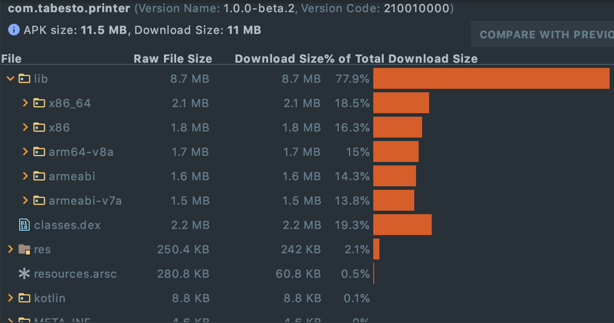
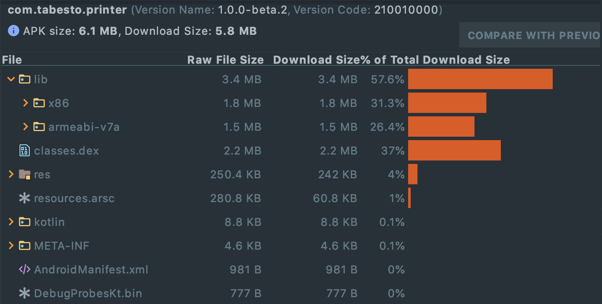
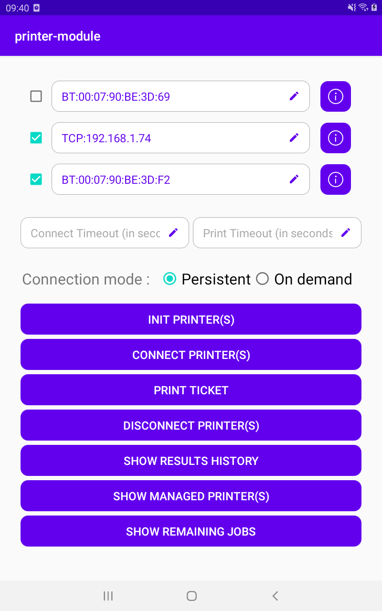
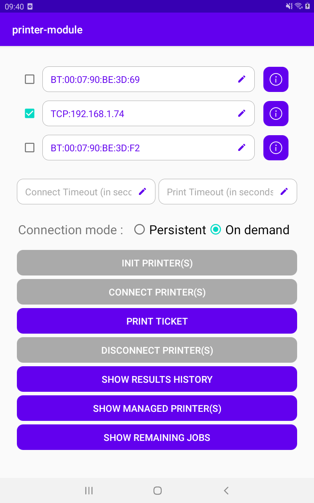

[](https://jitpack.io/#Tabesto/android-pos-printer) [](https://www.codefactor.io/repository/github/tabesto/android-pos-printer) 

# Tabesto POS printer module

## Description

This module allows you to use POS printers easily with your Android application.
With this wrapper module, we can handle printer(s) in a more convenient way, and add some flexibility.
For information, present module is currently used in production with all our customers.


**NB**: For now, only EPSON and its [ePOS SDK](https://download.epson-biz.com/modules/pos/index.php?page=single_soft&cid=6547&scat=61&pcat=52) is supported by the module.


## Features

- [x]  **Print** on **one** or **many** printer simultaneously.
- [x] **Customize ticket content** to print.
- [x] **Connect**, **disconnect** printers dynamically.
- [x] Retrieve printer **status** on demand.
- [ ] **Discover** dynamically printers around (bluetooth only). [Planned in future roadmap]


## Installation

Add it in your root build.gradle at the end of repositories:

```groovy
allprojects {
		repositories {
			...
			maven { url 'https://jitpack.io' }
		}
	}
```


Add the dependency in your module build.gradle, with the last version available [](https://jitpack.io/#Tabesto/android-pos-printer) :

```groovy
dependencies {
  	...
  	implementation 'com.github.Tabesto:android-pos-printer:{lastVersion}'
	}
```


By default, all architectures are available for the native Epson SDK and embedded in the printer library. If you have specific devices to target and want to optimize your APK size, you can filter the architectures to embed only specific ones (see the [official documentation](https://developer.android.com/studio/projects/gradle-external-native-builds#specify-abi) for more information) :

```groovy
android {
  ...
  defaultConfig {
    ...
    ndk {
      // Specifies the ABI configurations of your native
      // libraries Gradle should build and package with your APK.
      abiFilters 'x86', 'x86_64', 'armeabi', 'armeabi-v7a','arm64-v8a'
    }
  }
}
```

<details>
  <summary>See sample APK size comparison (click to expand)</summary>
   
</details>


## Logs

If you want to see the library logs inside your application, just plant a [Timber Tree](https://github.com/JakeWharton/timber) :

```kotlin
if (BuildConfig.DEBUG) {
    Timber.plant(Timber.DebugTree())
}
```


## Usage

See `sample` application.

A [Javadoc is available here.](https://tabesto.github.io/android-pos-printer/printer/)

🚧 TODO: add more detailed documentation with examples

 

*Note: for now, sample app is optimized for tablet screens*


## Contributing

All contributions are welcome ! If you want to contribute to the code, please refer to the following [CONTRIBUTING](CONTRIBUTING.md).

If you want to modify diagrams present in this README, you can find all resources in `/docs/resources  ` directory. You can open xml file with [draw.io](https://draw.io/).


## License

```
MIT License

Copyright (c) 2021 TABESTO

Permission is hereby granted, free of charge, to any person obtaining a copy
of this software and associated documentation files (the "Software"), to deal
in the Software without restriction, including without limitation the rights
to use, copy, modify, merge, publish, distribute, sublicense, and/or sell
copies of the Software, and to permit persons to whom the Software is
furnished to do so, subject to the following conditions:

The above copyright notice and this permission notice shall be included in all
copies or substantial portions of the Software.

THE SOFTWARE IS PROVIDED "AS IS", WITHOUT WARRANTY OF ANY KIND, EXPRESS OR
IMPLIED, INCLUDING BUT NOT LIMITED TO THE WARRANTIES OF MERCHANTABILITY,
FITNESS FOR A PARTICULAR PURPOSE AND NONINFRINGEMENT. IN NO EVENT SHALL THE
AUTHORS OR COPYRIGHT HOLDERS BE LIABLE FOR ANY CLAIM, DAMAGES OR OTHER
LIABILITY, WHETHER IN AN ACTION OF CONTRACT, TORT OR OTHERWISE, ARISING FROM,
OUT OF OR IN CONNECTION WITH THE SOFTWARE OR THE USE OR OTHER DEALINGS IN THE
SOFTWARE.
```

